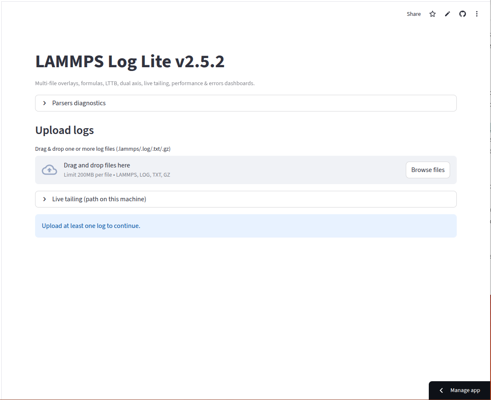

# LAMMPS Log Reader Streamlit App

Streamlit interface for inspecting LAMMPS simulation logs and plotting multi-run metrics.

## Prerequisites
Python 3.10+ recommended.

## Install (choose one)
```bash
# Option A: virtualenv (venv); create a virtual env and run app in it.
python -m venv .venv
source .venv/bin/activate  # mac/linux
.venv\\Scripts\\Activate.ps1  # Windows PowerShell
pip install -r streamlit_lmp_log_reader/requirements.txt
```

```bash
# Option B: Conda environment; create a conda env and run app in it.
# No conda yet? Install Miniconda from https://docs.conda.io/en/latest/miniconda.html
conda create -n lmp-log-reader python=3.11 -y
# or conda env create -f environment.yml
conda activate lmp-log-reader
pip install -r streamlit_lmp_log_reader/requirements.txt
```

## Run
```bash
streamlit run streamlit_lmp_log_reader/app.py
```
## Streamlit app
Try lammps_log_reader at: https://lammpslogreader.streamlit.app/

## Docs
Official setup references: https://docs.streamlit.io/ · https://docs.conda.io/en/latest/ · https://henriasv.github.io/lammps-logfile/
## Preview


Credits: GPT, Perplexity
